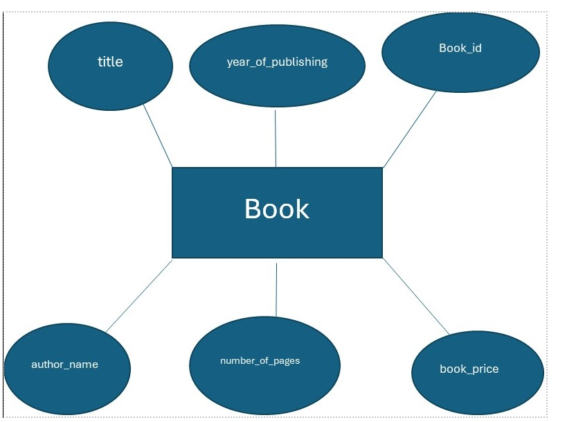

# Ex02 Django ORM Web Application
## Date: 

## AIM
To develop a Django application to store and retrieve data from a Book database using Object Relational Mapping(ORM).

## Entity Relationship Diagram



## DESIGN STEPS

### STEP 1:
Clone the problem from GitHub

### STEP 2:
Create a new app in Django project

### STEP 3:
Enter the code for admin.py and models.py

### STEP 4:
Execute Django admin and create details for 10 books

## PROGRAM
```
models.py

from django.db import models
from django.contrib import admin
class Book(models.Model):
    title=models.CharField(max_length=20);
    year_of_publishing=models.DateField();
    Book_id=models.CharField(max_length=20,primary_key=True);
    author_name=models.CharField(max_length=15);
    number_of_pages=models.IntegerField();
    book_price=models.IntegerField();
class BookAdmin(admin.ModelAdmin):
   list_display=("title","year_of_publishing","author_name","number_of_pages","book_price");
```
```
from django.contrib import admin
from .models import Book,BookAdmin
admin.site.register(Book,BookAdmin)
```

## OUTPUT


## RESULT
Thus the program for creating a database using ORM hass been executed successfully
